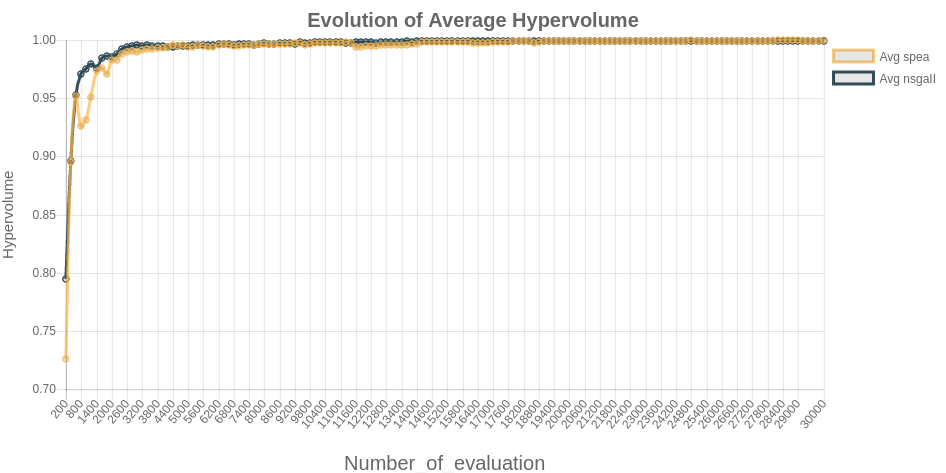

## Obtención de los datos y retorno del gráfico

Para crear el gráfico, no basta sólo con generar un color y las etiquetas pertinentes de los ejes de coordenadas, para poder generar el gráfico y retornarlo al lado cliente, hay que realizar una serie de tareas. El orden para la generación del gráfico es el siguiente:

* Crear la clase del gráfico
* Crear un método *get_datasets*
* Crear un método *get_labels*

Una vez se realiza estas tres operaciones, es necesario retornar el objeto creado con la siguiente estructura:

```python

from jchart import Chart
from jchart.config import Axes, DataSet, rgba

class BarChart(Chart):
    chart_type = 'bar'

    def get_labels(self, **kwargs):
        return ["January", "February", "March", "April",
                "May", "June", "July"]

    def get_datasets(self, **kwargs):
        data = [10, 15, 29, 30, 5, 10, 22]
        colors = [
            rgba(255, 99, 132, 0.2),
            rgba(54, 162, 235, 0.2),
            rgba(255, 206, 86, 0.2),
            rgba(75, 192, 192, 0.2),
            rgba(153, 102, 255, 0.2),
            rgba(255, 159, 64, 0.2)
        ]

        return [DataSet(label='Bar Chart',
                        data=data,
                        borderWidth=1,
                        backgroundColor=colors,
                        borderColor=colors)]
```
## Retorno de datos en MetAnalyze

Para la generación de los gráficos en **MetAnalyze** ha sido necesario realizar algunos cambios en la generación de los gráficos:

```python
class MinChart(Chart):
    getConfiguration = Configuration.objects.filter().latest('id')
  
    chart_type = 'line'
    scales = {
        'yAxes': [{'scaleLabel':{'display':True,'labelString':'Hypervolume','fontSize':int(15)}}],
        'xAxes' : [{'scaleLabel':{'display':True,'labelString':str(getConfiguration.evaluation),'fontSize':int(20)}}]
        
    }

    title = {
        'display': True,
        'text': 'Evolution of Minimum Hypervolume',
        'fontSize': 20,
    }
    legend = {
        'display': True,
        'position': 'right'
    }
    responsive = True
    

    def get_datasets(self,*args):
        getConfiguration = Configuration.objects.filter().latest('id')
        algorithm_names = []
        getAlgorithms = Algorithms.objects.filter(configuration__id=getConfiguration.id).values().distinct()
        for i in range(int(getConfiguration.nAlgorithms)):
            algorithm_names.append(getAlgorithms[i]['algorithm'])
        dataModel = MinChartModel.objects.filter().latest('id')
        data = dataModel.listValues
        chartReturned = []
        data_scatter = dataset(data)
        borderColor = []
        for i,v in enumerate(data_scatter):
            borderColor.append(colors.colors())

        for i,v in enumerate(data_scatter):
            chartReturned.append(DataSet(type='line',label='Min '+str(algorithm_names[i]),showLine=True,data=v, 
                borderColor=borderColor[i],fill=False))
        return chartReturned

    def get_labels(self,*args, **kwargs):

        dataModel = MinChartModel.objects.filter().latest('id')
        data = dataModel.listValues
        labelsChart=labels(data)
        return labelsChart
```

Debido a que los datos que se reciben no son estáticos es decir, no siempre se recibirán a comparar 2 algoritmos, ni 3 sino que pueden ser 2,3 ó 4, fue necesario realizar una serie de cambios para la generación de diferentes colores y la obtención de las etiquetas. Además, debido a que el nombre de los algoritmos tampoco será el mismo, fue necesario realizar cambios a la hora de retornar el gráfico generado.

## Renderización de los gráficos

Para renderizar los gráficos, hay que realizar una configuración tanto en el lado servidor como en lado cliente.

### Configuración en el lado servidor

Para retornar los gráficos desde el lado servidor, hay que importar los diferentes gráficos que se han creado:

`from charts import MinChart,AvgChart,MaxChart,MinAvgMaxChart`

Una vez importados los diferentes gráficos creados, se debe retornar cada componente como un diccionario

`dicOutput = {}`
`dicOutput['minavgmax_chart'] = MinAvgMaxChart`
`return render(request, 'app/results.html',dicOutput)`

### Configuración en el lado cliente

Como el gráfico generado se recibe como un objeto canvas, es necesario añadir en la plantilla *HTML* la posibilidad de recibir este tipo de objeto.

```html
<div class="row" >
			<div class="col s12">
				<br/>{{min_chart.as_html}}
			</div>
			
		</div>
		<button class="btn waves-effect waves-light indigo darken-3" type="button" name="action" id="saveMinChart-btn">
        	<i class="material-icons right">send</i>Save Minimum Bound Chart
      	</button><br/>
```

## Resultados obtenidos del experimento

