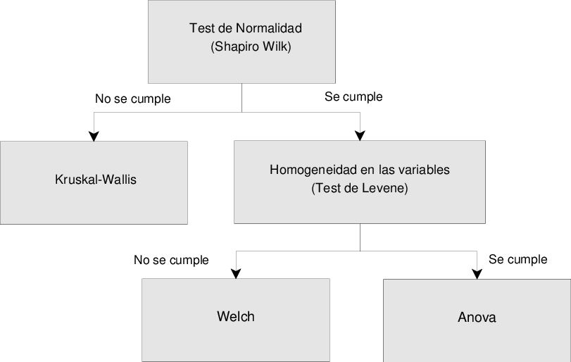

## Análisis estadístico

Para la validación de los datos obtenidos por las diferentes metaheurísticas, es necesario aplicar una serie de tests estadísticos para dar una solidez a los datos obtenidos. Para la realización de este análisis es necesario utilizar una serie de tests estadísticos en un orden en concreto. A continuación, se muestra una imagen de los diferentes tests estadísticos utilizados y el orden de ejecución de los mismos.

## Test estadísticos

